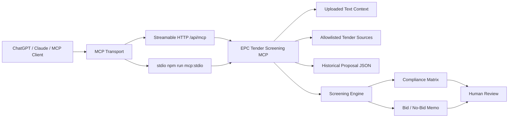

# Architecture

## Design Principles

- MCP-first: the core product is the tool layer, not a web UI.
- Upload-first: agents extract text from files and pass it to MCP tools.
- Source-controlled discovery: public tender search only uses explicit source URLs.
- Deterministic evals: sample fixtures are checked through the real MCP stdio transport.
- Human review: outputs are advisory and require tender, legal, finance, and management review.

## Runtime Modes

| Mode | Command / URL | Purpose |
|---|---|---|
| stdio | `npm run mcp:stdio` | Local MCP clients |
| HTTP | `/api/mcp` | Hosted custom connectors |
| OAuth demo | `/oauth/*` and `/.well-known/*` | Connector registration experiments |
